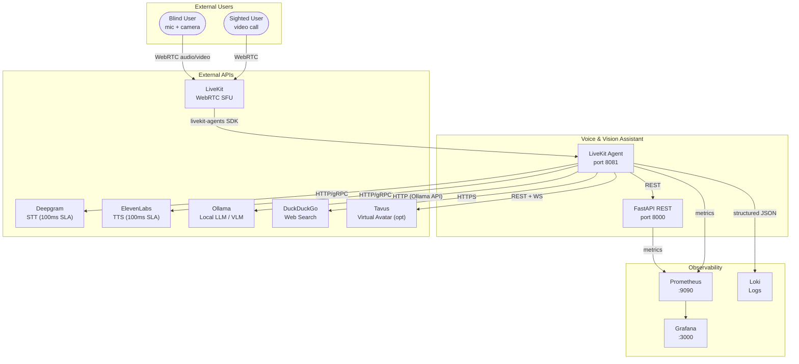
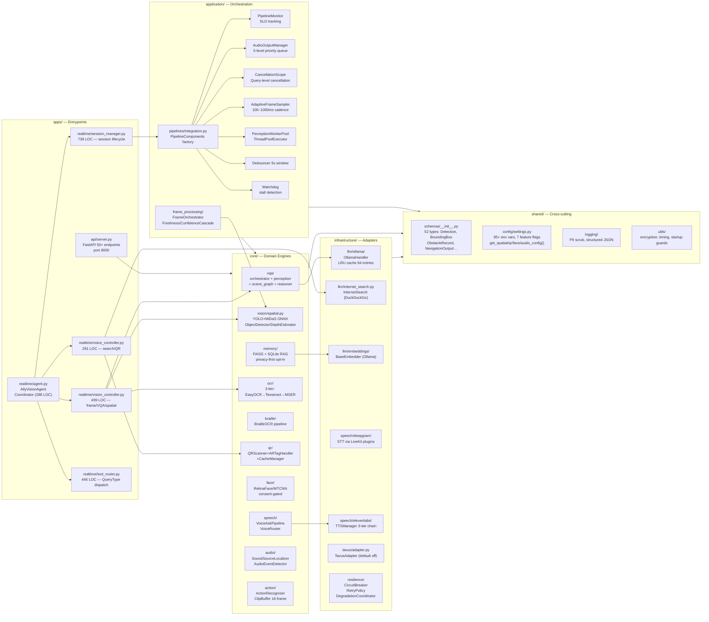
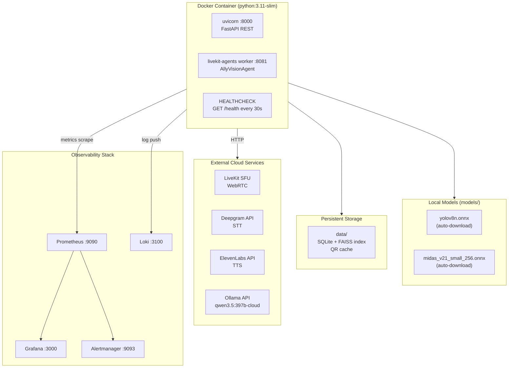

# Architecture — Voice & Vision Assistant for Blind

> **Assumptions**: Inferred from source code; no runtime profiling performed.
> All file references are relative to the repository root.

## One-Line Summary

Real-time, privacy-first accessibility assistant that fuses WebRTC audio, computer vision, and LLM reasoning into sub-500ms spoken responses for blind users.

---

## System Context Diagram

---

## Component / Container Diagram

---

## Deployment Topology

---

## Communication Patterns

| From | To | Protocol | Sync/Async | SLA |
|------|----|----------|-----------|-----|
| LiveKit SFU | Agent | WebRTC / livekit-agents SDK | Async stream | — |
| Agent | Deepgram | gRPC via LiveKit plugin | Async | 100ms |
| Agent | ElevenLabs | HTTPS chunked | Async stream | 100ms |
| Agent | Ollama | HTTP REST (OpenAI-compat) | Async SSE | 300ms |
| Agent | DuckDuckGo | HTTPS | Async | 5s timeout |
| Agent | Tavus | REST + WebSocket | Async | 5s timeout |
| API | Core engines | In-process function calls | Async | — |
| Prometheus | API/Agent | HTTP scrape /metrics | Pull, 10s | — |

---

## Security & Auth

- **Secrets**: 9 secrets (LiveKit, Deepgram, ElevenLabs, Ollama, Tavus keys) never logged; `PIIScrubFilter` active in all handlers.  (`shared/config/settings.py:251–263`)
- **Face data**: AES-256 encrypted at rest (`FACE_ENCRYPTION_ENABLED=true` default); consent required before any storage. (`shared/config/settings.py:122–127`)
- **Memory/RAG**: `MEMORY_ENABLED=false` by default; requires explicit consent endpoint `/memory/consent`. (`core/memory/privacy_controls.py`)
- **Debug endpoints**: Gated by `DEBUG_ENDPOINTS_ENABLED` + `DEBUG_AUTH_TOKEN` Bearer check. (`apps/api/server.py:46–70`)
- **Docker**: Non-root `appuser`, no build tools in runtime image. (`deployments/docker/Dockerfile:58–79`)
- **CI**: Bandit SAST scan + pip-audit CVE scan on every push. (`ci.yml:143–271`)

---

## Observability

- **Metrics**: Prometheus scrapes `/metrics` on api:8000 and agent:8081 every 10s; Grafana dashboards + Alertmanager rules. (`deployments/prometheus/prometheus.yml`)
- **Logging**: Structured JSON via `configure_logging()`; `PIIScrubFilter` redacts emails, IPs, face IDs, API keys. (`shared/logging/logging_config.py`)
- **Health**: `GET /health` returns JSON `{status: ok}`; Docker HEALTHCHECK every 30s. (`deployments/docker/Dockerfile:82–83`)
- **SLO tracking**: `PipelineMonitor` tracks per-stage latency (STT 100ms, VQA 300ms, TTS 100ms, total 500ms). (`application/pipelines/pipeline_monitor.py`)
- **Session debug**: `SessionLogger` ring buffer captures per-turn state for offline inspection. (`shared/debug/`)

---

## Failure Modes & Resilience

- **Circuit breakers**: Per-service (Deepgram, ElevenLabs, Ollama, LiveKit, Tavus, DuckDuckGo); 3 failures → open; 30–60s reset. (`infrastructure/resilience/circuit_breaker.py`)
- **Retry policies**: Exponential backoff with cap; Deepgram/ElevenLabs max 2 retries, Ollama max 3. (`infrastructure/resilience/retry_policy.py`)
- **TTS fallback chain**: ElevenLabs → local Edge TTS (en-US-AriaNeural) → pyttsx3. (`infrastructure/speech/tts_failover.py`)
- **STT fallback**: Deepgram → local Whisper (configurable model size). (`infrastructure/speech/stt_failover.py`)
- **OCR fallback**: EasyOCR → Tesseract → MSER heuristic. (`core/ocr/`)
- **Graceful degradation**: `DegradationCoordinator` announces degraded state via TTS at most every 30s. (`infrastructure/resilience/degradation_coordinator.py`)
- **Pipeline never crashes**: All engine methods return error strings; `try/except` at every boundary.

---

## Recommended Next Engineering Tasks

1. **S** — Add CORS middleware and rate-limiting to `apps/api/server.py` (currently missing, noted in `apps/api/AGENTS.md`).
2. **M** — Replace `shared/config/settings.py` flat dict with `pydantic-settings` `BaseSettings` for type-safe validation (noted in `shared/config/AGENTS.md`).
3. **L** — Implement `application/event_bus/` and `application/session_management/` stubs into real production modules for decoupled inter-component communication.
