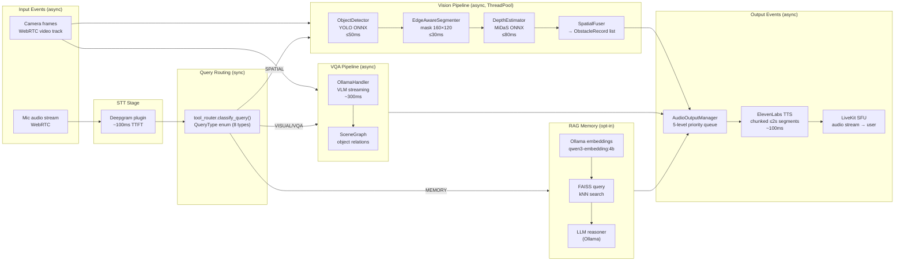

# Dataflow — Voice & Vision Assistant for Blind

> **Assumptions**: Schemas inferred from `shared/schemas/__init__.py`; storage from `core/memory/`; throughput from config defaults.

---

## Primary Data Stores

| Store | Technology | Location | Purpose |
|-------|-----------|----------|---------|
| Memory index | FAISS (CPU) | `data/faiss_index/` | Semantic vector search for RAG |
| Memory metadata | SQLite | `data/memory.db` | Text, timestamps, retention metadata |
| QR cache | JSON files (TTL 24h) | `qr_cache/` | Offline QR decode results |
| Face embeddings | AES-256 encrypted files | `data/face_embeddings/` | Opt-in face recognition (consent-gated) |
| Session ring buffer | In-memory (`SessionLogger`) | RAM only | Per-turn debug snapshots (no persistence) |
| ONNX models | Binary files | `models/` | YOLOv8n, MiDaS — auto-downloaded with SHA-256 check |
| Config | Env vars / `.env` | Process environment | 85+ settings; 9 secrets never logged |

---

## Inferred SQLite Schema (core/memory/sqlite_manager.py)

```
memories
├── id          TEXT PRIMARY KEY
├── content     TEXT              -- raw text or summarised text
├── embedding   BLOB              -- float32 vector (serialised)
├── timestamp   REAL              -- epoch seconds
├── source      TEXT              -- "vqa" | "ocr" | "user" | "system"
├── frame_id    TEXT              -- links to perception event
└── expires_at  REAL              -- auto-expiry epoch (NULL = permanent)

consent
├── scope       TEXT PRIMARY KEY  -- "memory" | "face"
├── granted     INTEGER           -- 1 = yes
└── updated_at  REAL
```

---

## Event / Message Flows



---

## Async vs Sync Flows

| Flow | Mode | Timeout |
|------|------|---------|
| STT (Deepgram) | **Async** stream | 2s |
| Frame capture (LiveKit) | **Async** WebRTC | 500ms freshness |
| YOLO/MiDaS inference | **Async** (`run_in_executor`) | 300ms pipeline |
| Ollama VLM request | **Async** SSE stream | 10s |
| ElevenLabs TTS | **Async** chunked | 2s per chunk |
| DuckDuckGo search | **Async** | 5s |
| RAG memory query | **Async** | 10s (LLM) |
| QR decode (pyzbar) | **Async** (`run_in_executor`) | 2s |
| Circuit breaker check | **Sync** (in-memory state) | — |
| Config read | **Sync** (dict lookup) | — |

---

## Example JSON Payloads

### ObstacleRecord (shared/schemas/__init__.py:307–322)
```json
{
  "id": "obj_1",
  "class": "chair",
  "bbox": [320, 240, 480, 400],
  "centroid_px": [400, 320],
  "distance_m": 1.52,
  "direction": "slightly left",
  "direction_deg": -12.0,
  "mask_confidence": 0.87,
  "confidence": 0.91,
  "priority": "near",
  "size_category": "medium",
  "action_recommendation": "step right"
}
```

### NavigationOutput (shared/schemas/__init__.py:326–341)
```json
{
  "short_cue": "Caution, Chair 1.5 metres slightly left – step right",
  "verbose_description": "A medium-sized chair is located 1.52 metres to your slightly left at -12 degrees. High confidence detection. Recommended action: step right.",
  "telemetry": [{"id":"obj_1","class":"chair","distance_m":1.52,"priority":"near"}],
  "has_critical": false
}
```

### PerceptionResult (shared/schemas/__init__.py:272–282)
```json
{
  "detections": [{"id":"det_0","class":"person","confidence":0.88,"bbox":[100,50,250,400],"centroid_px":[175,225]}],
  "masks": [{"detection_id":"det_0","boundary_confidence":0.82,"mask_area_px":18000}],
  "depth_map": {"min_depth":0.5,"max_depth":4.2,"is_metric":false},
  "image_size": [640, 480],
  "latency_ms": 142.3,
  "timestamp": "2026-03-02T15:00:00Z",
  "frame_id": "frame_0042"
}
```

---

## Throughput & Bottleneck Analysis

| Stage | Target | Bottleneck Risk |
|-------|--------|----------------|
| STT (Deepgram) | 100ms | Network RTT to Deepgram |
| Frame capture | 100ms cadence | Camera stall (Watchdog detects) |
| YOLO detect | ≤50ms | CPU if no ONNX GPU provider |
| MiDaS depth | ≤80ms | Memory bandwidth (disabled by default) |
| Ollama VLM | ≤300ms | GPU VRAM saturation on large models |
| ElevenLabs TTS | ≤100ms TTFT | Network RTT to ElevenLabs |
| FAISS kNN | ≤20ms | Index size (currently unbounded) |
| Total hot path | **500ms** | Ollama latency is dominant |

**Key observations:**
- Segmentation (`ENABLE_SEGMENTATION=false`) and depth (`ENABLE_DEPTH=false`) are disabled by default to meet the 300ms pipeline SLA.
- `PerceptionWorkerPool` uses `ThreadPoolExecutor` to keep CPU-bound ONNX inference off the asyncio event loop.
- `AdaptiveFrameSampler` backs off to 1000ms when system load is high.
- `Debouncer` (5s window) prevents TTS saturation from repeated identical cues.

---

## Privacy / PII Considerations

| Data | Handling |
|------|---------|
| Camera frames | Never persisted unless `RAW_MEDIA_SAVE=true` (default: false) |
| Face embeddings | AES-256 encrypted; opt-in consent required; GDPR `/export/erase` endpoint |
| Voice audio | Streamed to Deepgram; not stored locally |
| Memory RAG text | `MEMORY_ENABLED=false` default; consent endpoint gates activation; auto-expiry |
| API keys / secrets | `PIIScrubFilter` active; never appear in structured logs |
| IP addresses | Scrubbed by `PIIScrubFilter` in log output |
| Debug endpoints | Bearer token required; `DEBUG_ENDPOINTS_ENABLED=false` in production |
