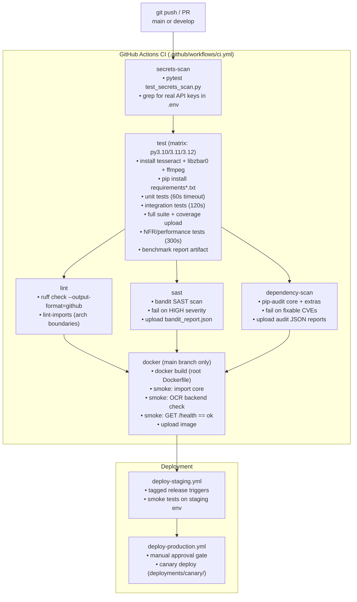
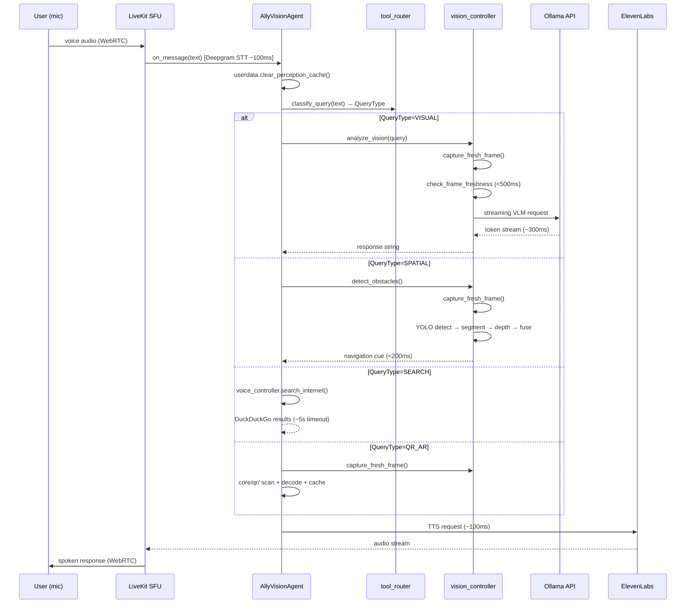
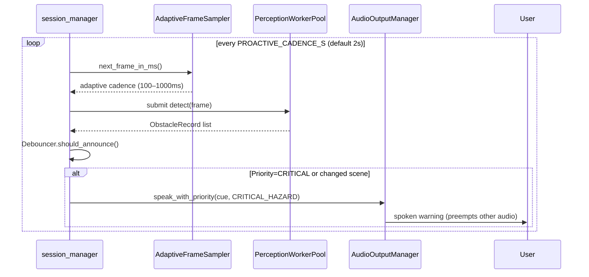
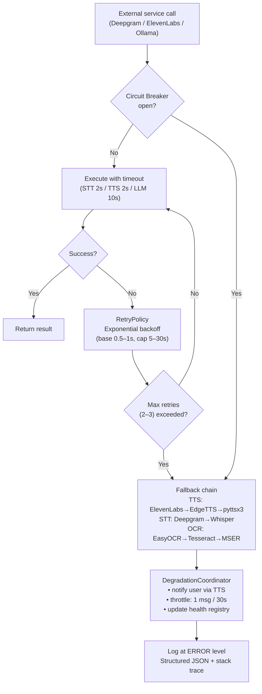

# Workflow — Voice & Vision Assistant for Blind

> **Assumptions**: CI pipeline inferred from `.github/workflows/ci.yml`; runtime flow from `apps/realtime/AGENTS.md` and source code.

---

## Developer Workflow

```
1. Clone → python -m venv .venv → .venv/Scripts/activate
2. pip install -e ".[dev]"          # editable + dev extras
3. cp .env.example .env             # fill API keys
4. python -m apps.realtime.entrypoint download-files   # fetch ONNX models
5. uvicorn apps.api.server:app --host 0.0.0.0 --port 8000   # REST API
6. python -m apps.realtime.entrypoint dev               # LiveKit agent (dev mode)
7. Connect at agents-playground.livekit.io
```

**Lint & gate before pushing:**
```bash
ruff check . --fix && ruff format .
lint-imports                # architectural boundary enforcement
pytest tests/unit/ -q --timeout=60
```

---

## CI/CD Pipeline



---

## Runtime Request Lifecycle

### Voice Query → Spoken Response



---

### Continuous Proactive Processing (always-on)



---

## Error Handling & Rollback



**Rollback policy:**
- Container health probe fails → Docker restarts container automatically.
- Production deploy: canary under `deployments/canary/` before full rollout.
- No database migrations; SQLite/FAISS stored in `data/` volume (persistent).

---

## Build Artifacts & Caching

| Artifact | Location | Retention |
|----------|----------|-----------|
| Coverage XML | `coverage.xml` | Uploaded to Codecov |
| Benchmark report | `benchmark_report.json` | GitHub Actions artifact |
| Bandit SAST report | `bandit_report.json` | GitHub Actions artifact |
| pip-audit reports | `pip_audit_*.json` | GitHub Actions artifact |
| Docker image | Local daemon (main branch) | Tagged `voice-vision-assistant:latest` |
| pip cache | `~/.cache/pip` | Keyed on `requirements.txt` hash |
