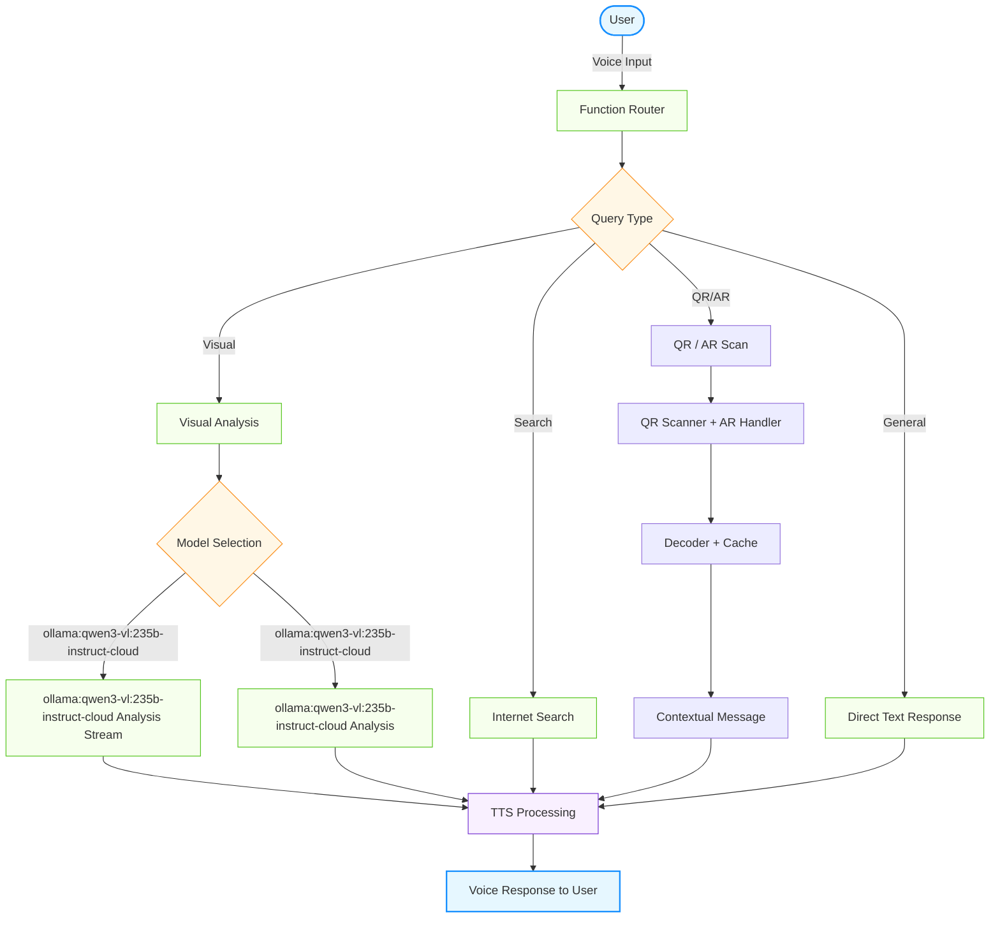

<div align="center">

# ✨ Voice & Vision Assistant for Blind ✨

### An Advanced Voice & Vision Assistant for Blind and Visually Impaired Users

*Bridging the visual gap through AI-powered assistance*

</div>

---

## 📋 Overview

Voice & Vision Assistant for Blind combines cutting-edge speech recognition, natural language processing, and computer vision to create an intuitive assistant specifically designed for blind and visually impaired users. This thoughtfully crafted solution helps users better understand their surroundings and interact with the world more confidently and independently.

---

## 🏗️ System Architecture

The system utilizes an elegant multi-component architecture to process user inputs and generate helpful responses:



---

## ✨ Key Features

### 🔄 Dual Vision Model Approach
* **People Detection First:** ollama:qwen3-vl:235b-instruct-cloud checks for presence of people
* **Conditional Processing:** ollama:qwen3-vl:235b-instruct-cloud for scenes without people, ollama:qwen3-vl:235b-instruct-cloud for scenes with people
* **Privacy-Aware:** Thoughtful descriptions while respecting privacy

### 🚀 Spatial Perception & Micro-Navigation (NEW)
* **Object Detection:** Real-time detection of obstacles using YOLO/ONNX models
* **Edge-Aware Segmentation:** Precise object boundaries for accurate localization
* **Depth Estimation:** Per-pixel depth maps for distance calculation
* **Spatial Fusion:** Combined detection + depth for navigation cues
* **Micro-Navigation Output:** Concise TTS warnings like "Obstacle 1.5m ahead, slightly left"

### 🌊 Real-time Response Streaming
* Progressive output for improved user experience
* Natural conversational flow with minimal latency
* Immediate feedback during interaction

### 👁️ Blind/Low-Vision Optimizations
* **Detailed Descriptions:** Prioritizes key elements for visually impaired users
* **Voice-First Design:** Intuitive speech interface reduces barriers
* **Concise Analysis:** Thorough yet efficient scene descriptions

### 🎭 Virtual Avatar Integration
* **Visual Representation:** Optional virtual avatar for video calls
* **Enhanced Communication:** Helps blind users interact with sighted individuals
* **Professional Presence:** Maintains visual engagement in meetings and calls

### 🔤 Braille Engine (NEW)
* **Camera Capture Analysis:** Checks brightness, contrast, focus, angle before OCR
* **Dot Segmentation:** CLAHE + adaptive threshold + contour detection + grid fitting
* **Grade 1 Classification:** English braille lookup table + PyTorch model stub
* **End-to-End OCR:** `BrailleOCR.read()` pipeline: deskew → segment → classify → text
* **Embossing Guidance:** Layout generation, overlay rendering, verification
* **12 Real-World Scenarios:** Medicine labels, elevators, menus, transit signs, and more

### 📝 OCR Engine Hardening (NEW)
* **3-Tier Fallback:** EasyOCR → Tesseract → MSER heuristic → helpful error message
* **Auto-Probe:** Detects which backends are installed at startup
* **Install Scripts:** `scripts/install_ocr_deps.sh` for automated setup
* **OS-Aware Hints:** Platform-specific install instructions when backends are missing

### 🧠 Memory Engine (Privacy-First)
* **MEMORY_ENABLED=false by default** — opt-in only
* **Persistent Consent:** `/memory/consent` endpoint with file-backed storage
* **RAG Pipeline:** FAISS indexer + Ollama embeddings (qwen3-embedding:4b) + Claude/Ollama reasoning
* **Retention Policies:** Auto-expiry, user-initiated deletion, raw media controls

### 🐳 Docker & CI/CD (NEW)
* **Multi-stage Dockerfile:** python:3.11-slim with tesseract, libzbar, ffmpeg
* **GitHub Actions CI:** Test matrix (3.10–3.12), linting, Docker build
* **Dependency Checker:** `scripts/check_deps.py` for environment validation

### 🧩 Comprehensive Capabilities
* **Voice Interaction:** Natural conversation using speech
* **Visual Understanding:** Camera-based vision to describe surroundings
* **Internet Search:** Real-time information lookup
* **QR/AR Scanning:** Decode QR codes and AR tags with contextual deep linking
* **Braille Reading:** Capture → decode → speak braille text from camera frames
* **Seamless Integration:** Coordinated operation between components

### 📱 QR / AR Tag Scanning & Offline Cache (NEW)
* **Camera-Based QR Detection:** Scan QR codes from live frames using pyzbar or OpenCV
* **AR Marker Detection:** Recognise ArUco markers for spatial tagging
* **Content Classification:** URLs, locations, transport stops, products, contacts, WiFi
* **Contextual Deep Linking:** Raw QR data is transformed into spoken context (e.g. "Bus stop 145 — Route 14 to Downtown")
* **Offline-First Cache:** Previously scanned results are stored locally with configurable TTL
* **Navigation Integration:** QR codes containing location data offer "Would you like me to guide you there?"
* **REST API:** `/qr/scan`, `/qr/cache`, `/qr/history`, `/qr/debug` endpoints

---

## 🔧 Technical Implementation

### Model Selection

We carefully selected `ollama:qwen3-vl:235b-instruct-cloud` as our primary people detection model based on:

| Criteria | Performance |
|:---------|:------------|
| Response Time | TTFT < 150ms (well below 500ms requirement) |
| Batch Processing | Handles 10+ consecutive image queries without degradation |
| Streaming | Provides token-by-token streaming for responsive UX |
| People Recognition | Reliably identifies presence of people in images |
| Image Limits | 4MB (base64), 20MB (URL), multiple images supported |
| Success Rate | >95% in testing |

### ollama:qwen3-vl:235b-instruct-cloud API Integration

The ollama:qwen3-vl:235b-instruct-cloud API powers our ollama:qwen3-vl:235b-instruct-cloud model implementation when people are detected in scenes:

* **⚡ Fast Processing:** Sub-500ms TTFT meets accessibility requirements
* **🧠 Advanced Models:** Leverages state-of-the-art ollama:qwen3-vl:235b-instruct-cloud capabilities
* **🔌 Simple Integration:** Clean API with official Python client library

---

## 🗂️ Project Structure

```
Voice-Vision-Assistant-for-Blind/
├── apps/                          # Entrypoints
│   ├── api/server.py              # FastAPI REST API
│   ├── realtime/                  # LiveKit real-time agent
│   │   ├── entrypoint.py          # Agent launcher
│   │   └── agent.py               # Agent logic (2 087 LOC)
│   └── cli/                       # Debug tools (re-exports shared/debug)
│
├── core/                          # Pure domain logic (engines)
│   ├── vqa/                       # Visual question answering
│   ├── memory/                    # RAG memory (privacy-first)
│   ├── face/                      # Face detection & tracking
│   ├── audio/                     # Audio event detection
│   ├── qr/                        # QR / AR scanning + cache
│   ├── ocr/                       # OCR with 3-tier fallback
│   ├── action/                    # Action recognition
│   ├── braille/                   # Braille capture → OCR
│   ├── speech/                    # Voice pipeline + TTS bridge
│   └── vision/                    # Spatial perception & detection
│
├── application/                   # Use-case orchestration
│   ├── frame_processing/          # Frame orchestrator, freshness, cascade
│   └── pipelines/                 # Debouncer, watchdog, worker pool, TTS, …
│
├── infrastructure/                # External system adapters
│   ├── llm/                       # Ollama, internet search
│   ├── speech/                    # Deepgram (STT), ElevenLabs (TTS)
│   └── tavus/                     # Virtual avatar adapter
│
├── shared/                        # Cross-cutting utilities
│   ├── config/                    # Settings & environment
│   ├── logging/                   # Structured logging
│   ├── schemas/                   # Shared data structures & ABCs
│   ├── debug/                     # Debug visualizer & session logger
│   └── utils/                     # Encryption, timing, helpers
│
├── tests/                         # Test suite (429+ tests)
│   ├── unit/                      # Fast isolated tests
│   ├── integration/               # Cross-module tests
│   ├── realtime/                  # Live pipeline tests
│   └── performance/               # NFR / benchmark tests
│
├── research/                      # Benchmarks, experiments, reports
├── scripts/                       # Setup & utility scripts
├── docs/                          # Documentation
├── configs/                       # config.yaml
├── models/                        # ML model weights (ONNX)
├── data/                          # Persistent runtime data
├── deployments/                   # Docker & Compose files
│
├── pyproject.toml                 # Package config, tool settings, import-linter
├── requirements.txt               # Core dependencies
├── requirements-extras.txt        # Optional: OCR, Claude, GPU, dev
├── Dockerfile                     # Root Dockerfile (COPY . .)
└── docker-compose.test.yml        # Docker Compose for local testing
```

**Dependency rule** — each layer may only import from layers below it:

```
apps/ → application/, core/, infrastructure/, shared/
application/ → core/, shared/
core/ → shared/ only
infrastructure/ → shared/ only
shared/ → standard library only
```

Boundaries are enforced by [import-linter](https://import-linter.readthedocs.io/) — run `lint-imports` locally or check CI.

---

## 🚀 Getting Started

### Prerequisites

* **Python 3.9+** - Core programming language
* **LiveKit API** - For real-time communication
* **Ollama** - For ollama:qwen3-vl:235b-instruct-cloud capabilities
* **Deepgram API** - For speech-to-text functionality
* **ElevenLabs API** - For text-to-speech synthesis
* **ollama:qwen3-vl:235b-instruct-cloud API** - For fallback vision processing

### Installation

<details>
<summary><b>1. Clone the repository</b></summary>

```bash
git clone https://github.com/codingaslu/Ally-Clone-Assignment.git
cd Ally-Clone-Assignment
```
</details>

<details>
<summary><b>2. Set up environment</b></summary>

```bash
python -m venv .venv
source .venv/bin/activate  # On Windows: .venv\Scripts\activate
pip install -U pip
pip install -e ".[dev]"    # Editable install with dev extras
# — or —
pip install -r requirements.txt
pip install -r requirements-extras.txt  # optional
```
</details>

<details>
<summary><b>3. Configure environment variables</b></summary>
   
Create a `.env` file with the following:
```
LIVEKIT_URL=your_livekit_url
LIVEKIT_API_KEY=your_livekit_key
LIVEKIT_API_SECRET=your_livekit_secret
DEEPGRAM_API_KEY=your_deepgram_key
OLLAMA_API_KEY=your_ollama_api_key
ELEVEN_API_KEY=your_elevenlabs_key

# Vision configuration
VISION_PROVIDER=ollama

# Ollama API configuration
OLLAMA_VL_API_KEY=your_ollama_api_key  # Get your API key from Ollama
OLLAMA_VL_MODEL_ID=ollama:qwen3-vl:235b-instruct-cloud

# Tavus virtual avatar configuration (optional)
ENABLE_AVATAR=false
TAVUS_API_KEY=your_tavus_api_key
TAVUS_REPLICA_ID=your_replica_id
TAVUS_PERSONA_ID=your_persona_id
TAVUS_AVATAR_NAME=ally-vision-avatar

# =========================================================================
# SPATIAL PERCEPTION CONFIGURATION (NEW)
# =========================================================================

# Enable/disable spatial perception
SPATIAL_PERCEPTION_ENABLED=true

# Object Detection (optional - uses mock detector by default)
SPATIAL_USE_YOLO=false
YOLO_MODEL_PATH=models/yolov8n.onnx
YOLO_CONF_THRESHOLD=0.5

# Depth Estimation (optional - uses simple estimator by default)
SPATIAL_USE_MIDAS=false
MIDAS_MODEL_PATH=models/midas_small.onnx
MIDAS_MODEL_TYPE=MiDaS_small

# Enable/disable pipeline components
ENABLE_SEGMENTATION=true
ENABLE_DEPTH=true

# Distance thresholds (meters)
CRITICAL_DISTANCE_M=1.0
NEAR_DISTANCE_M=2.0
FAR_DISTANCE_M=5.0

# Low-latency mode for critical warnings
LOW_LATENCY_WARNINGS=true

# =========================================================================
# QR / AR TAG SCANNING CONFIGURATION (NEW)
# =========================================================================
ENABLE_QR_SCANNING=true
QR_CACHE_ENABLED=true
QR_AUTO_DETECT=true
QR_CACHE_TTL_SECONDS=86400
# QR_CACHE_DIR=       # leave empty for default (qr_cache/)

```
</details>

<details>
<summary><b>4. Virtual Avatar Setup (Optional)</b></summary>

### Tavus Virtual Avatar Integration

1. **Prerequisites**:
   - Sign up for a [Tavus](https://tavus.com) account
   - Create a replica (virtual avatar)
   - Generate an API key

2. **Installation**:
   - The required dependencies are included in the requirements.txt file
   - Make sure you have `livekit-agents[tavus]` and `livekit-plugins-tavus` installed

3. **Configuration**:
   Add the following to your `.env` file:
   ```
   # Tavus virtual avatar configuration
   ENABLE_AVATAR=true
   TAVUS_API_KEY=your_tavus_api_key
   TAVUS_REPLICA_ID=your_replica_id
   TAVUS_PERSONA_ID=your_persona_id
   TAVUS_AVATAR_NAME=ally-vision-avatar
   ```

4. **Persona Setup**:
   You need to create a Tavus persona with specific settings using the Tavus API:
   ```bash
   curl --request POST \
     --url https://tavusapi.com/v2/personas \
     -H "Content-Type: application/json" \
     -H "x-api-key: <your-tavus-api-key>" \
     -d '{
       "layers": {
           "transport": {
               "transport_type": "livekit"
           }
       },
       "persona_name": "Ally Assistant Avatar",
       "pipeline_mode": "echo"
   }'
   ```
   - Save the `id` from the response as your `TAVUS_PERSONA_ID`
   - Use your replica ID as `TAVUS_REPLICA_ID`

5. **When to Use**:
   - Professional meetings where visual presence helps
   - Family video calls with sighted relatives
   - Educational or work environments
   - Any situation where blind users benefit from having a visual representation

The avatar will automatically handle the audio output when enabled, creating a seamless experience for both the blind user and sighted participants in the conversation.
</details>

### Running the Application

| Step | Command | Description |
|:-----|:--------|:------------|
| 1 | `python -m apps.realtime.entrypoint download-files` | Download dependencies |
| 2a | `python -m apps.realtime.entrypoint start` | Start in standard mode |
| 2b | `python -m apps.realtime.entrypoint dev` | Start in development mode |
| 3 | `uvicorn apps.api.server:app --host 0.0.0.0 --port 8000` | Start REST API |
| 4 | Connect via [LiveKit playground](https://agents-playground.livekit.io/) | Begin interaction |

### Docker

```bash
# Using root Dockerfile
docker build -t voice-vision-assistant .
docker run -p 8000:8000 -p 8081:8081 --env-file .env voice-vision-assistant

# Using canonical Dockerfile (smaller layer)
docker build -f deployments/docker/Dockerfile -t voice-vision-assistant .
docker run -p 8000:8000 -p 8081:8081 --env-file .env voice-vision-assistant
```

### Running Tests

```bash
# All 429+ tests
python -m pytest tests/ -v --tb=short

# Unit tests only
python -m pytest tests/unit/ -v

# With coverage
python -m pytest tests/ --cov=core --cov=application --cov=infrastructure --cov=shared --cov=apps --cov-report=term-missing

# Check architectural boundaries
lint-imports
```

---

## 🛠️ Implementation Details

### Core Components

#### 🎙️ Voice Pipeline
* **STT:** Deepgram for real-time speech-to-text conversion
* **TTS:** ElevenLabs for natural-sounding text-to-speech

#### 🧠 Language Processing
* **Primary LLM:** Ollama ollama:qwen3-vl:235b-instruct-cloud for conversational intelligence
* **Function Routing:** Dynamic selection of appropriate capabilities

#### 👁️ Vision Processing
* **People Detection:** ollama:qwen3-vl:235b-instruct-cloud to determine presence of people
* **Scene Analysis:** ollama:qwen3-vl:235b-instruct-cloud for scenes without people, ollama:qwen3-vl:235b-instruct-cloud for scenes with people

#### � Spatial Perception Pipeline (NEW)
* **Object Detection:** YOLO/ONNX-based real-time obstacle detection
* **Edge-Aware Segmentation:** Boundary-preserving object masks
* **Depth Estimation:** MiDaS/simple heuristic depth maps
* **Spatial Fusion:** Combined detection + segmentation + depth
* **Navigation Output:** Priority-sorted obstacles with TTS-ready cues

```
Pipeline: FRAME → DETECT → SEGMENT → DEPTH → FUSE → NAVIGATION
```


---

## 🧩 Challenges and Solutions

### Privacy-Preserving Vision

**Challenge:** ollama:qwen3-vl:235b-instruct-cloud sometimes refuses to describe people in images due to privacy guardrails.

**Solution:**
1. ollama:qwen3-vl:235b-instruct-cloud model first checks for presence of people in images
2. Route to appropriate model based on content (ollama:qwen3-vl:235b-instruct-cloud for no people, ollama:qwen3-vl:235b-instruct-cloud for people)
3. Response normalization for consistent user experience

### Performance Optimization

**Approaches:**
* ⚡ Efficient API client configuration
* 🖼️ Image preprocessing and optimization
* ⏱️ Parallel processing where appropriate
* 🌊 Response streaming for immediate feedback

---

## 📊 Performance and Limitations

| Aspect | Details |
|:-------|:--------|
| Connectivity | Requires stable internet connection |
| API Rate Limits | Subject to provider limitations |
| Image Size | Max 4MB (base64), 20MB (URL) |
| Context Window | 128K tokens in preview |

---

## 🔮 Future Roadmap

| Planned Feature | Description |
|:----------------|:------------|
| 🖼️ Advanced preprocessing | Enhanced image optimization pipeline |
| 🗺️ Location integration | OpenStreetMap integration for location context |
| 🌤️ Environmental data | Weather, distance, and temporal information |
| 📱 Code recognition | QR code detection and processing |
| ⚡ Performance upgrades | Response caching for improved speed |
| 🎞️ Sequential analysis | Multi-image sequence processing |
| 🎙️ Voice personalization | Customizable voice profile selection |
| 🎯 Advanced depth models | Integration with ZoeDepth, Metric3D |
| 🚶 Motion tracking | Temporal smoothing for walking navigation |
| 📡 Hardware acceleration | TensorRT/CoreML optimization |

---

## 🆕 Spatial Perception Architecture

### Overview

The spatial perception module provides real-time obstacle detection and micro-navigation for blind users:

```
┌─────────────┐     ┌──────────────┐     ┌────────────────┐     ┌─────────────┐
│   Camera    │────▶│   Object     │────▶│   Edge-Aware   │────▶│    Depth    │
│   Frame     │     │  Detection   │     │  Segmentation  │     │  Estimation │
└─────────────┘     └──────────────┘     └────────────────┘     └─────────────┘
                                                                       │
                    ┌──────────────┐     ┌────────────────┐            │
                    │  Navigation  │◀────│    Spatial     │◀───────────┘
                    │   Output     │     │    Fusion      │
                    └──────────────┘     └────────────────┘
```

### Components

| Component | Description | Output |
|:----------|:------------|:-------|
| **ObjectDetector** | Detects objects using YOLO/mock | Bounding boxes, classes, scores |
| **EdgeAwareSegmenter** | Refines object boundaries | Binary masks with confidence |
| **DepthEstimator** | Estimates per-pixel depth | Depth map (metric/relative) |
| **SpatialFuser** | Combines all spatial data | ObstacleRecords with distance/direction |
| **MicroNavFormatter** | Generates navigation cues | Short TTS cue, verbose description, JSON |

### Priority Thresholds

| Distance | Priority | Response |
|:---------|:---------|:---------|
| < 1.0m | 🔴 Critical | "Stop! [Object] very close [direction]" |
| 1.0-2.0m | 🟠 Near Hazard | "Caution, [object] [distance] [direction]" |
| 2.0-5.0m | 🟡 Far Hazard | "[Object] [distance] [direction]" |
| > 5.0m | 🟢 Safe | Path clear or low priority |

### Example Output

```json
{
  "id": "obj_1",
  "class": "chair",
  "distance_m": 1.52,
  "direction": "slightly left",
  "direction_deg": -12.0,
  "priority": "near",
  "action_recommendation": "step right"
}
```

**TTS Output:** "Caution, Chair 1.5 meters slightly left – step right"

---

## 📄 License

This project is proprietary and confidential. All rights reserved.

---

## 👏 Acknowledgments

* **LiveKit** - WebRTC infrastructure
* **Ollama** - ollama:qwen3-vl:235b-instruct-cloud capabilities  
* **Deepgram** - Speech recognition technology
* **ElevenLabs** - Voice synthesis technology

---

<div align="center">

## 📞 Support

For issues or questions, please contact:

**Email:** muhammedaslam179@gmail.com  
**GitHub:** [Open an Issue](https://github.com/codingaslu/Envision-AI/issues)

</div>

## 🔧 Troubleshooting

### QR / AR Scanning Issues

| Issue | Solution |
|:------|:---------|
| QR scanning not available | Install pyzbar: `pip install pyzbar`. On Windows also install the zbar DLL (or rely on the OpenCV fallback) |
| No QR detected | Ensure the QR code fills at least 15 % of the frame and has good contrast |
| AR markers not detected | ArUco detection requires OpenCV ≥ 4.7 with the `aruco` module |
| Cache not persisting | Check the `qr_cache/` directory exists and is writable |

### General Issues

| Issue | Solution |
|:------|:---------|
| Missing dependencies | Run `pip install -r requirements.txt` to install all required packages |
| API keys not working | Double-check your `.env` file for correct API keys and ensure all services are properly configured |
| Camera not enabling | Ensure your device has a camera and the necessary permissions are granted |
| Voice not working | Check your microphone settings and verify Deepgram API key is valid |
