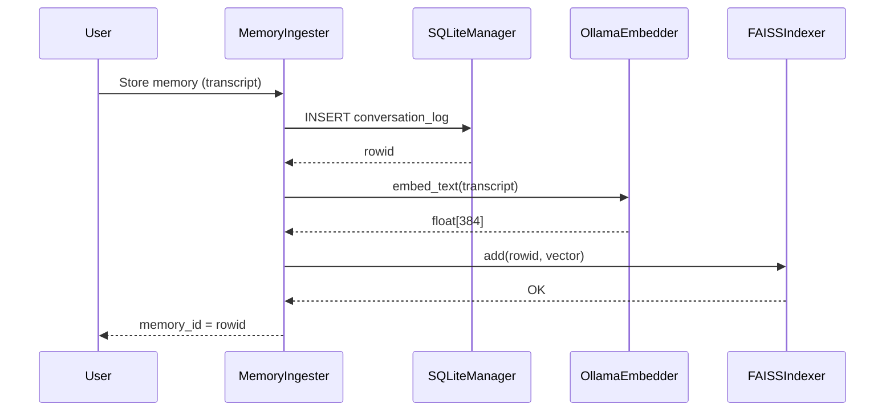
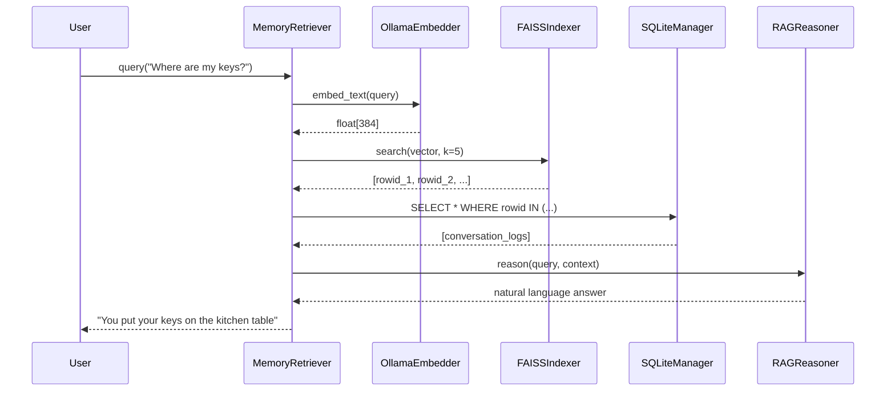

# Data Flow

The Voice & Vision Assistant for Blind processes data through several concurrent pipelines, ensuring that visual perception, speech recognition, and memory retrieval operate with minimal latency. This document details the data movement within the Hybrid Memory Architecture.

## Hybrid Memory Architecture (Added 2026-02-22)

The data flow within the memory system is designed to maintain a strict separation between semantic vector indexing and structured data storage. This ensures that all retrieved memories are grounded in the original textual content while benefiting from high-speed vector search.

### Memory Ingestion Flow

The ingestion process occurs when the system captures a significant user interaction or visual scene description that warrants long-term storage.

1. **Capture**: The system captures a user interaction, which may include a voice transcript, a visual scene description, or a structured scene graph.
2. **Persistence**: The `MemoryIngester` sends the raw content and metadata to the `SQLiteManager`.
3. **Database Write**: SQLite inserts the data into the `conversation_logs` table and returns a unique `rowid`.
4. **Vectorization**: The raw text is passed to the `OllamaEmbedder`, which interfaces with the local `qwen3-embedding:4b` model.
5. **Embedding Generation**: The model generates a 384-dimensional float vector representing the semantic content of the interaction.
6. **Indexing**: The `MemoryIngester` sends the `rowid` and the generated vector to the `FAISSIndexer`.
7. **Vector Storage**: FAISS adds the vector to its index at a position that maps to the `rowid` and persists the updated index to `data/memory_index/`.
8. **Acknowledgment**: The system confirms successful ingestion and returns the memory ID (the `rowid`) to the caller.

### Memory Retrieval Flow

The retrieval process is triggered when a user asks a question that requires historical context (e.g., "Where did I put my keys?").

1. **Query Capture**: The user's query is transcribed via the STT pipeline and passed to the `MemoryRetriever`.
2. **Query Vectorization**: The `MemoryRetriever` sends the query text to the `OllamaEmbedder`.
3. **Query Embedding**: The `OllamaEmbedder` generates a 384-dimensional query vector.
4. **Semantic Search**: The query vector is passed to the `FAISSIndexer` for a similarity search.
5. **Candidate Retrieval**: FAISS performs a nearest-neighbor search and returns the top-K `rowids` based on the L2 distance between the query vector and the stored embeddings.
6. **Content Lookup**: The `MemoryRetriever` uses the returned `rowids` to query the `SQLiteManager` for the original text and metadata.
7. **Context Assembly**: The retrieved records are formatted into a context block, including timestamps and relevancy indicators.
8. **RAG Reasoning**: The query and the context block are sent to the `RAGReasoner`, which invokes the `qwen3.5:cloud` LLM.
9. **Answer Generation**: The LLM synthesizes a natural language answer grounded in the retrieved memories.
10. **Delivery**: The final response is delivered to the user via the TTS pipeline.

### Mermaid Sequence Diagram — Ingestion Flow

The following diagram illustrates the sequential operations involved in storing a new memory.

### Mermaid Sequence Diagram — Retrieval Flow

The following diagram illustrates the sequential operations involved in retrieving and reasoning over historical context.

### Data Storage Locations

The following table summarizes the storage backends used for memory and state management.

| Store | Path | Contents | Format |
|-------|------|----------|--------|
| SQLite | `data/app_state.db` | Conversation logs, user preferences, engine settings, telemetry | Relational (SQL) |
| FAISS | `data/memory_index/` | Vector embeddings (384-dim float) | FAISS binary index |
| Local Cache | `data/cache/` | Temporary OCR results and perception snapshots | JSON / Binary |
| Session Logs | `data/logs/` | Structured application logs and debug traces | Text / JSONL |

### Data Lifecycle and Retention

To manage storage growth and ensure data relevance, the system implements a lifecycle management policy.

- **Ingestion Timestamping**: Every record in SQLite and entry in FAISS is associated with a creation timestamp.
- **Background Pruning**: A maintenance task runs periodically to identify records exceeding the `MEMORY_RETENTION_DAYS` limit (default: 30 days).
- **Atomic Deletion**: When a record is pruned, it is removed from both the SQLite database and the FAISS index in a single coordinated operation to prevent index fragmentation and data leakage.
- **User-Initiated Purge**: Users can request a complete deletion of their memory history, which triggers a full reset of both storage backends.

### Privacy and Security Considerations

Data flow is restricted by several privacy-preserving mechanisms:

- **Local-Only Embeddings**: Vector embeddings are generated locally on the device, ensuring that raw textual data is not sent to external services for vectorization.
- **Cloud Boundary**: Only the finalized query and the specific retrieved context are sent to the cloud reasoning engine. Raw images and audio are never stored or transmitted unless specifically authorized.
- **At-Rest Protection**: The SQLite database and FAISS index can be optionally protected using local encryption managers if configured.

This data flow architecture provides a scalable and secure foundation for long-term memory assistance, balancing the need for rapid retrieval with strict privacy requirements.
