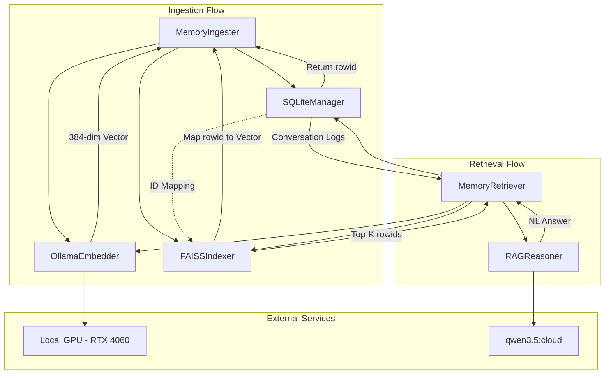

# High Level Design

## Hybrid Memory Architecture (Added 2026-02-22)

The Hybrid Memory Architecture provides a robust, low-latency solution for long-term state management and contextual retrieval. By combining structured relational storage with high-performance vector indexing, the system enables the assistant to remember past interactions, user preferences, and spatial context while maintaining strict privacy boundaries and ensuring data integrity across system restarts.

### Architectural Objectives

The memory system is designed around several core objectives to ensure it meets the accessibility requirements of blind and visually impaired users:

*   **Low Latency Retrieval**: Vector search must complete in sub-100ms to allow for real-time conversational context without stalling the speech pipeline. This is critical for maintaining the natural flow of conversation, where delays of even a few hundred milliseconds can be perceived as a system failure.
*   **Structured Metadata Integrity**: Crucial user data, such as medication labels, frequently visited locations, and individual preferences, must be stored in a reliable relational format that supports complex queries and ACID properties. This ensures that the system's "hard" knowledge remains consistent and accurate.
*   **Privacy-First Persistence**: Memories are only stored upon explicit user consent. The system supports automatic expiry and user-initiated deletion of both vector and relational records. Privacy is a first-class citizen in the architectural design, with clear boundaries between shared and private data.
*   **Hardware Efficiency**: The system optimizes local GPU usage by limiting embedding models to those that can fit within a ~2GB VRAM footprint, leaving sufficient headroom for vision models. By running embeddings locally, the system reduces reliance on external APIs and improves overall reliability.

### System Component Overview

The Voice & Vision Assistant is composed of several high-level modules that interact to deliver a seamless accessibility experience:

*   **LiveKit Agent**: Manages real-time WebRTC streams for audio and video, serving as the primary interface for user interaction. It handles signaling, media negotiation, and ensures low-latency delivery of voice responses. The agent acts as the gateway between the user's sensory environment and the system's processing logic.
*   **FastAPI Server**: Provides a comprehensive REST API for system configuration, memory management, and diagnostic monitoring. It allows for the management of user consent, retrieval of system health, and direct interaction with the memory store for debugging purposes. The server is the control plane for the entire application.
*   **Perception Pipeline**: Processes incoming video frames through a cascade of object detection, depth estimation, and spatial fusion models. It generates a real-time scene graph that can be ingested into memory to provide spatial context for future queries. This pipeline effectively "sees" the world and translates it into a machine-understandable format.
*   **Memory Engine**: Orchestrates the ingestion and retrieval of multimodal memories using a hybrid approach of relational (SQLite) and vector (FAISS) storage. It acts as the central hub for all persistent state, bridging the gap between momentary perception and long-term knowledge.
*   **Speech Pipeline**: Handles the transition between natural speech and machine-readable text using streaming STT and high-fidelity TTS engines. It ensures that the assistant's voice remains natural and responsive, providing the primary feedback loop for the blind user.
*   **Infrastructure Adapters**: Encapsulate external service logic for model inference, speech processing, and search. These adapters provide a unified interface that shields the domain logic from specific third-party API implementation details, allowing the system to swap providers with minimal disruption.

### Memory Engine Components

The memory engine utilizes a hybrid architecture to balance structured data integrity with unstructured similarity search:

*   **SQLiteManager**: A new module that manages the `data/app_state.db` database. It handles persistent CRUD operations for conversation logs, user preferences, engine settings, and telemetry. It serves as the authoritative source for structured metadata, returning primary keys (rowids) that are used as cross-references in the vector index. This ensures that every vector corresponds to a valid, detailed record in the relational store.
*   **FAISSIndexer**: Manages an in-process FAISS vector index. It stores 384-dimensional embeddings generated from text and associates them with SQLite rowids. This allows for extremely fast nearest-neighbour searches across thousands of stored memories without the overhead of a full database management system, providing the "associative" memory of the system.
*   **OllamaEmbedder**: A local GPU service that generates 384-dimensional vector representations of text using the `qwen3-embedding:4b` model. It requires approximately 2GB of VRAM and runs on the local NVIDIA RTX 4060 hardware, ensuring that embedding generation is fast, secure, and does not require a cloud connection.
*   **MemoryIngester**: The primary entry point for memory storage. It orchestrates the ingestion flow by first inserting the structured record into SQLite, then generating an embedding via the OllamaEmbedder, and finally storing the resulting vector in the FAISS index. It manages the transactional integrity between the two storage backends.
*   **MemoryRetriever**: Handles the retrieval of relevant context for RAG operations. It embeds the incoming query, searches the FAISS index for the most similar vectors, and then performs a bulk lookup in SQLite to retrieve the full, human-readable conversation logs. This component is responsible for filtering and ranking results to ensure relevance.
*   **RAGReasoner**: A reasoning engine that synthesizes a natural language answer from the retrieved context and the user's query. It utilizes the `qwen3.5:cloud` model to ensure high-quality, contextually grounded responses that are helpful to the user, providing a conversational interface to the system's memory.

### Component Interaction Diagram

The following diagram illustrates the high-level flow of data during ingestion and retrieval operations within the hybrid memory system, highlighting the separation between local compute and cloud reasoning.

### Data Flow Lifecycle

1.  **Input Acquisition**: The user provides a voice command or the perception pipeline identifies a significant scene change.
2.  **Contextual Enrichment**: The system combines the raw input with current spatial data (scene graph) and metadata.
3.  **Ingestion Phase**: If consent is granted, the data is passed to the `MemoryIngester`, which splits it into structured (relational) and unstructured (vector) parts. The structured part is saved first to generate a stable ID.
4.  **Retrieval Phase**: For new queries, the `MemoryRetriever` finds relevant past interactions by comparing vector distances in the FAISS index.
5.  **Reasoning Phase**: The `RAGReasoner` uses the retrieved context to ground its response, ensuring the assistant provides accurate and personally relevant information.

### Deployment View

The system is designed for single-node deployment, leveraging containerization for consistent environment management and simplified updates:

*   **Hardware**: Optimized for local execution on an NVIDIA RTX 4060 (8GB VRAM). The memory engine is configured to peak at approximately 2GB VRAM usage for embeddings, ensuring coexistence with vision models.
*   **Docker Container**: The entire stack is packaged in a Debian-based Docker image, including the FastAPI server, LiveKit agent, and all necessary ML runtimes. This ensures that all dependencies are correctly versioned and isolated.
*   **Data Volumes**: Persistent data is stored in dedicated, host-mounted volumes to ensure survival across container restarts:
    *   `data/app_state.db`: SQLite database for structured records.
    *   `data/memory_index/`: Binary files for the FAISS vector index and associated metadata.
*   **Persistence Strategy**: FAISS indices are serialized to disk periodically (or upon clean shutdown), while SQLite uses Write-Ahead Logging (WAL) to ensure data integrity during concurrent access and provide faster write performance.

### Future Scalability Considerations

As the volume of user memories grows, the architecture can be extended in the following ways:

*   **Index Partitioning**: Splitting the FAISS index by session or time-frame to maintain search performance at extreme scales.
*   **Distributed Embeddings**: Offloading embedding generation to a separate node if VRAM constraints become critical.
*   **Multi-Modal Retrieval**: Extending the `FAISSIndexer` to support image-based retrieval alongside text-based queries.
*   **Cloud-Hybrid Vector Search**: Implementing a tiered search approach where the most recent memories are searched locally, while older ones are queried in a secure cloud vector store.

### Conclusion

Through this hybrid design, the Voice & Vision Assistant achieves a balance between the reliability of traditional relational databases and the flexibility of modern vector-based retrieval. This architecture provides a foundation for an intelligent, contextual assistant that truly understands its user's world, offering a personalized experience that respects privacy while delivering the low-latency performance required for real-time accessibility.

The Hybrid Memory Architecture represents a critical step forward in providing assistive technologies that are not only functional but also contextual and adaptive to the individual needs of blind and visually impaired users. By prioritizing local compute and privacy, the system builds a relationship of trust with the user, ensuring their data remains under their control while still benefiting from state-of-the-art AI capabilities.
