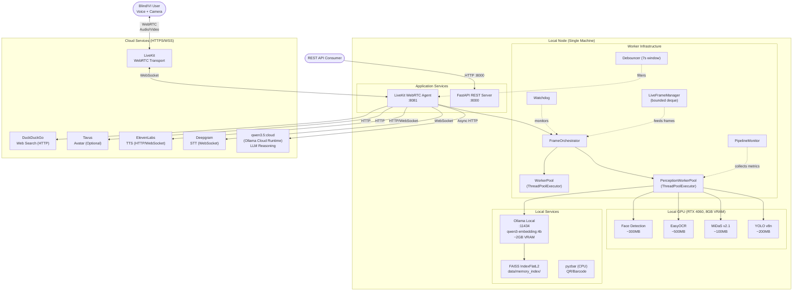

# Deployment Architecture

## 1. Local Node Architecture

The local deployment stack runs all perception, embedding, and orchestration services on a single machine with GPU acceleration. The node is designed as a voice-first, single-user assistive device.

### 1.1 Application Services

| Service | Framework | Port | Runner | Description |
|---------|-----------|------|--------|-------------|
| **FastAPI REST Server** | FastAPI 0.128+ | 8000 | uvicorn | 30+ endpoints for config, memory, QR, braille, face, and debug operations. Bearer token auth on debug routes (DEBUG_AUTH_TOKEN). |
| **LiveKit WebRTC Agent** | livekit-agents 1.3+ | 8081 | livekit-agents SDK | Real-time audio/video agent. Receives camera frames and voice via LiveKit, processes perception pipeline, returns synthesized speech. Primary user interaction point. |

### 1.2 Worker Pools

| Worker | Type | Purpose |
|--------|------|---------|
| **PerceptionWorkerPool** | ThreadPoolExecutor | Offloads GPU-bound inference (detection, depth, OCR, embedding) from the asyncio event loop. Enables parallel execution of YOLO + MiDaS + EasyOCR per frame. |
| **WorkerPool** | ThreadPoolExecutor | Generic async task executor for non-GPU parallel operations (file I/O, metadata processing). |

### 1.3 Local GPU Models (NVIDIA RTX 4060, 8GB VRAM, CUDA)

| Model | Technology | Est. VRAM | Model Path | Notes |
|-------|-----------|-----------|------------|-------|
| qwen3-embedding:4b | Torch CUDA via Ollama local | ~2,000 MB | Managed by Ollama (port 11434) | Text embeddings for RAG memory indexing. Always active. |
| YOLO v8n | ONNX Runtime CUDA EP | ~200 MB | models/yolov8n.onnx | Object detection for spatial perception. Active when SPATIAL_USE_YOLO=true. |
| MiDaS v2.1 small | ONNX Runtime CUDA EP | ~100 MB | models/midas_v21_small_256.onnx | Per-pixel depth estimation. Active when SPATIAL_USE_MIDAS=true. |
| EasyOCR | PyTorch CUDA | ~500 MB | PyTorch hub cache | Primary OCR backend. GPU-accelerated text recognition. |
| Face Detection | PyTorch CUDA | ~300 MB | PyTorch hub cache | Face detection and embedding generation. Active when ENABLE_FACE=true. |
| **Peak Total** | | **~3,100 MB** | | **38.75% of 8GB VRAM** |

### 1.4 Local Data Services

| Service | Technology | Storage Path | Description |
|---------|-----------|-------------|-------------|
| **FAISS Vector Store** | FAISS IndexFlatL2 (in-process) | data/memory_index/ | Similarity search for memory embeddings. File persistence (index.faiss + metadata.json). Limited to ~5,000 vectors. Uses threading.RLock for thread safety. |
| **Ollama Local** | Ollama daemon | localhost:11434 | Hosts qwen3-embedding:4b for local embedding generation. HTTP API (Ollama native). |
| **QR Cache** | File-based JSON with TTL | qr_cache/ | Offline-first cache for previously scanned QR code results. Configurable TTL (default: 86400s). |

### 1.5 System Services

| Service | File | Type | Description |
|---------|------|------|-------------|
| **Watchdog** | application/pipelines/watchdog.py | asyncio background task | Monitors pipeline health, detects frame processing stalls (>10s), triggers automatic pipeline restarts. |
| **PipelineMonitor** | application/pipelines/pipeline_monitor.py | asyncio background task | Collects and reports real-time processing metrics across perception and reasoning pipelines. |
| **Debouncer** | application/pipelines/debouncer.py | In-memory time-based | Prevents redundant processing of similar navigation cues using a 7-second deduplication window. |
| **LiveFrameManager** | application/frame_processing/live_frame_manager.py | In-memory deque | Bounded frame buffer (collections.deque with maxlen) ensuring low-latency access to recent video frames. Drops old frames under load. |
| **FrameOrchestrator** | application/frame_processing/frame_orchestrator.py | In-process async | Per-frame fusion engine: collects parallel worker results, validates timestamps, builds SceneGraph for downstream reasoning. |

---

## 2. Cloud Services

All cloud dependencies are accessed via HTTPS or WSS. The infrastructure layer encapsulates all external integrations, isolating domain logic from provider-specific APIs.

| Service | Provider | Protocol | Purpose | Env Vars | Fallback |
|---------|----------|----------|---------|----------|----------|
| **qwen3.5:cloud** | Ollama cloud runtime | Async HTTP (compatible API) | LLM reasoning for VQA, RAG, general chat | OLLAMA_API_KEY | StubLLMClient (static "I don't have enough context" response) |
| **Deepgram** | Deepgram | WebSocket | Real-time speech-to-text transcription | DEEPGRAM_API_KEY | None (voice input loss; local Whisper fallback recommended but not implemented) |
| **ElevenLabs** | ElevenLabs | HTTP/WebSocket | Natural voice synthesis (TTS) | ELEVEN_API_KEY, ELEVENLABS_API_KEY | LiveKit may fall back to local TTS (undocumented automatic behavior) |
| **LiveKit** | LiveKit | WebSocket/WebRTC | Real-time audio/video transport and room management | LIVEKIT_URL, LIVEKIT_API_KEY, LIVEKIT_API_SECRET | None (core transport — total system failure if unavailable) |
| **Tavus** | Tavus | HTTP + WebSocket | Optional virtual avatar for video calls | TAVUS_API_KEY, TAVUS_REPLICA_ID, TAVUS_PERSONA_ID | Disabled by default (ENABLE_AVATAR=false). No impact when disabled. |
| **DuckDuckGo** | DuckDuckGo | HTTP | Web search for general knowledge queries | None (no API key needed) | Returns "search unavailable" — isolated failure, no pipeline impact |

### Cloud Resilience Status

| Service | Retry/Backoff | Circuit Breaker | Health Check |
|---------|--------------|-----------------|-------------|
| qwen3.5:cloud | Not implemented | Not implemented | None |
| Deepgram | Not implemented | Not implemented | Plugin-internal reconnect only |
| ElevenLabs | Not implemented | Not implemented | None |
| LiveKit | WebRTC built-in reconnect | Not implemented | None |
| DuckDuckGo | Not implemented | Not implemented | None |

> **Note**: Cloud resilience is a known gap (CLOUD_EFFICIENCY=4/10). Circuit breaker pattern (BACKLOG-004) and retry with exponential backoff are planned improvements.

---

## 3. Deployment Models

### 3.1 Development (Local)

**Target**: Single developer machine, all services running locally.

```bash
# 1. Create virtual environment
python -m venv .venv
.venv/Scripts/activate          # Windows
source .venv/bin/activate       # Linux/macOS

# 2. Install with dev extras
pip install -e ".[dev]"

# 3. Configure environment
cp .env.example .env
# Edit .env with API keys for Deepgram, ElevenLabs, LiveKit, Ollama

# 4. Start Ollama local (for embeddings)
ollama serve                    # Starts on port 11434
ollama pull qwen3-embedding:4b  # Download embedding model

# 5. Start REST API server
uvicorn apps.api.server:app --host 0.0.0.0 --port 8000

# 6. Start real-time agent (separate terminal)
python -m apps.realtime.entrypoint dev
```

**Environment**:
- Python 3.10+ (tested on 3.10, 3.11, 3.12)
- `.env` file with API keys (see `.env.example`)
- GPU: Optional — all models have CPU fallback paths
- Ollama local daemon required for embedding generation

### 3.2 Production (Hybrid Docker)

**Target**: Docker deployment with GPU acceleration for full performance.

```bash
# Build using canonical Dockerfile
docker build -f deployments/docker/Dockerfile -t voice-vision-assistant .

# Run with environment variables injected at runtime (NOT baked into image)
docker run \
  --gpus all \
  -p 8000:8000 \
  -p 8081:8081 \
  -e DEEPGRAM_API_KEY=... \
  -e ELEVEN_API_KEY=... \
  -e LIVEKIT_URL=... \
  -e LIVEKIT_API_KEY=... \
  -e LIVEKIT_API_SECRET=... \
  -e OLLAMA_API_KEY=... \
  -v /path/to/models:/app/models \
  -v /path/to/data:/app/data \
  voice-vision-assistant

# Or use Docker Compose for local testing
docker compose -f docker-compose.test.yml up
```

**Docker Configuration**:
- **Base image**: python:3.11-slim
- **System dependencies**: tesseract-ocr, libzbar0, ffmpeg
- **Canonical Dockerfile**: `deployments/docker/Dockerfile`
- **Alternative Dockerfile**: Root `Dockerfile` (COPY . . — includes full source)
- **Exposed ports**: 8000 (REST API), 8081 (WebRTC Agent)
- **GPU**: Required for full performance — use nvidia-docker runtime (`--gpus all`)
- **Volumes**: Mount `models/` for ONNX weights, `data/` for persistent FAISS index

**Known Security Issues (Production Blockers)**:
- ISSUE-002 (P0): Both Dockerfiles run containers as root — must add non-root user
- ISSUE-019 (P0): Root Dockerfile copies `.env` with secrets into image — must use runtime env vars only
- ISSUE-001 (P0): Real API keys committed in `.env` — must rotate all keys before production deployment

### 3.3 Scaling Considerations

The system is designed as a **single-process, single-user** assistive device. Horizontal scaling is not currently supported.

| Constraint | Current Limit | Impact |
|-----------|--------------|--------|
| **Process model** | Single-process (asyncio + ThreadPoolExecutor) | No horizontal scaling; one instance per machine |
| **FAISS index** | IndexFlatL2, O(n) search, ~5,000 vector limit | Memory search degrades linearly; not suitable for large-scale knowledge bases |
| **GPU tenancy** | Single-tenant (one user per GPU) | Concurrent users would require separate GPU allocations or time-slicing |
| **Cloud services** | Scale independently via provider | No rate limiting on outbound API calls (risk of provider throttling) |
| **Agent monolith** | agent.py is 1,900+ lines | Development bottleneck; refactoring to microservices is a future consideration |

**Potential Future Architecture**:
- Separate FastAPI REST server and LiveKit agent into independent microservices
- Migrate FAISS from IndexFlatL2 to IVFFlat for sub-linear search (BACKLOG-005)
- Add Kubernetes deployment manifests for orchestrated multi-instance deployment
- Implement GPU time-sharing via NVIDIA MPS for concurrent user support

---

## 4. Network Architecture

### 4.1 Topology Diagram



### 4.2 Port Mappings

| Port | Protocol | Service | Access |
|------|----------|---------|--------|
| 8000 | HTTP | FastAPI REST Server | Local network / reverse proxy |
| 8081 | WebSocket/WebRTC | LiveKit WebRTC Agent | Via LiveKit server |
| 11434 | HTTP | Ollama Local (embedding) | localhost only |

### 4.3 External Connections

All outbound connections use encrypted transport:

| Destination | Protocol | Direction | Purpose |
|-------------|----------|-----------|---------|
| Ollama cloud runtime | HTTPS | Outbound | LLM reasoning (qwen3.5:cloud) |
| Deepgram API | WSS | Outbound | Real-time STT |
| ElevenLabs API | HTTPS/WSS | Outbound | TTS synthesis |
| LiveKit Cloud | WSS/WebRTC | Bidirectional | Audio/video transport |
| Tavus API | HTTPS/WSS | Outbound | Optional avatar rendering |
| DuckDuckGo | HTTPS | Outbound | Web search queries |

### 4.4 Environment Variables

All secrets are injected via environment variables at runtime. The `.env` file is used for local development only and must never be committed with real keys or baked into Docker images.

| Variable | Required | Service |
|----------|----------|---------|
| DEEPGRAM_API_KEY | Yes | Deepgram STT |
| ELEVEN_API_KEY | Yes | ElevenLabs TTS |
| LIVEKIT_URL | Yes | LiveKit server URL |
| LIVEKIT_API_KEY | Yes | LiveKit authentication |
| LIVEKIT_API_SECRET | Yes | LiveKit authentication |
| OLLAMA_API_KEY | Yes | Ollama cloud runtime (qwen3.5:cloud) |
| OLLAMA_VL_API_KEY | Yes | Ollama vision model |
| OLLAMA_VL_MODEL_ID | Yes | Vision model identifier |
| TAVUS_API_KEY | No | Tavus avatar (optional) |
| TAVUS_REPLICA_ID | No | Tavus replica (optional) |
| TAVUS_PERSONA_ID | No | Tavus persona (optional) |
| ENABLE_AVATAR | No | Enable/disable Tavus (default: false) |
| DEBUG_AUTH_TOKEN | No | Bearer token for debug endpoints |
| MEMORY_ENABLED | No | Enable/disable memory system (default: false) |
| EMBEDDING_MODEL | No | Embedding model name (default: qwen3-embedding:4b) |
