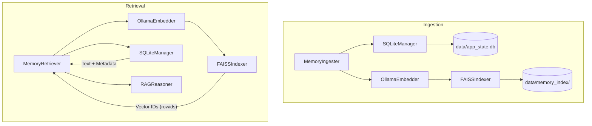

# System Architecture

The Voice & Vision Assistant for Blind implements a robust, layered architecture designed for real-time accessibility assistance. This system coordinates complex visual perception, natural language reasoning, and audio synthesis to provide a seamless user experience for visually impaired individuals.

## Hybrid Memory Architecture (Added 2026-02-22)

The system utilizes a Hybrid Memory Architecture that decouples semantic search capabilities from structured state management. This design ensures efficient retrieval of contextual information while maintaining a deterministic record of system state and user interactions.

### Overview

The Hybrid Memory Architecture separates memory into two distinct layers: a semantic vector store powered by FAISS and a structured relational database managed by SQLite. This separation eliminates the redundancy of storing raw text in the vector index, optimizes storage efficiency, and provides a clear boundary between approximate similarity search and exact data retrieval.

### Semantic Memory (FAISS)

The semantic layer is responsible for high-speed similarity search across user interactions and visual scene descriptions.

- **Storage Engine**: FAISS (Facebook AI Similarity Search) using the `IndexFlatL2` implementation for exact L2 distance calculation.
- **Embedding Model**: Local `qwen3-embedding:4b` model generating 384-dimensional float32 vectors.
- **VRAM Footprint**: Approximately 2GB of VRAM on the NVIDIA RTX 4060 GPU.
- **Index Contents**: The FAISS index stores only the numerical vector embeddings. No raw text or metadata is stored within the binary index files.
- **ID Reference**: Each vector in the index is associated with a unique identifier that maps directly to a primary key (rowid) in the SQLite database.
- **Persistence**: Index files are persisted to the `data/memory_index/` directory, supporting incremental updates and recovery.

### Structured Memory (SQLite)

The structured layer provides a reliable, ACID-compliant foundation for managing system state and historical records.

- **Database Engine**: SQLite 3, utilizing Write-Ahead Logging (WAL) mode for concurrent access and thread safety.
- **File Location**: `data/app_state.db`
- **Primary Tables**:
    - `conversation_logs`: Stores time-stamped transcripts, session identifiers, and scene graph references.
    - `user_preferences`: Manages persistent user settings and personalization data.
    - `engine_settings`: Records runtime configuration snapshots for reproducibility and debugging.
    - `telemetry_logs`: Captures performance metrics and system error events for analysis.
- **Functionality**: SQLite serves as the canonical source of truth for all textual content and metadata, providing exact retrieval based on identifiers returned by the semantic layer.

### ID Mapping Mechanism

The integration between FAISS and SQLite is maintained through a strict ID synchronization protocol. The SQLite auto-incrementing `rowid` serves as the universal identifier for every memory entry.

1. **Ingestion Process**:
    - Raw text and metadata are first inserted into the `conversation_logs` table in SQLite.
    - SQLite returns the unique `rowid` for the new record.
    - The `qwen3-embedding:4b` model generates a 384-dimensional embedding from the text.
    - The resulting vector is added to the FAISS index at the position corresponding to the `rowid`.
2. **Retrieval Process**:
    - A search query is embedded into the vector space.
    - FAISS performs a nearest-neighbor search and returns a set of candidate IDs (SQLite rowids).
    - SQLite performs a batch lookup using these rowids to retrieve the original text, timestamps, and associated metadata.

### Design Constraints

The architecture is governed by several critical constraints to ensure data integrity and system performance:

- **No Text Duplication**: Raw textual data is stored exclusively in SQLite. FAISS contains only numerical representations.
- **Atomic Synchronization**: Ingestion must succeed in both stores to be considered complete, preventing orphaned vectors or missing content.
- **Local Priority**: Embeddings are generated locally on the RTX 4060 to ensure privacy and reduce latency, while complex reasoning is offloaded to the cloud.
- **Thread Safety**: Operations on the FAISS index are protected by `threading.RLock()`, and SQLite handles concurrent access through WAL mode.

### Component Interaction Diagram

The following diagram illustrates the data flow between the memory components during ingestion and retrieval operations.

### System Context and Integration

The Hybrid Memory Architecture operates within a broader ecosystem of high-performance perception and communication components:

- **Computational Resources**: NVIDIA RTX 4060 (8GB VRAM) handling local inference with a peak usage of approximately 3.1GB.
- **Inference Engines**:
    - **Cloud Reasoning**: `qwen3.5:cloud` for high-level logic and conversational synthesis.
    - **Local Perception**: YOLO v8n for object detection, MiDaS v2.1 for monocular depth estimation.
    - **OCR Tiering**: Multimodal approach using EasyOCR with fallbacks to Tesseract for text recognition.
    - **Face Analysis**: Specialized modules for face detection and embedding.
- **Transport and Synthesis**:
    - **Real-time Audio**: LiveKit WebRTC for low-latency communication.
    - **Speech-to-Text**: Deepgram API for rapid voice transcription.
    - **Text-to-Speech**: ElevenLabs for high-fidelity natural voice output.

This architecture ensures that the assistant remains responsive, context-aware, and reliable in various environmental conditions, providing a foundation for future enhancements in spatial understanding and user assistance.

### Developer Considerations

Maintaining the Hybrid Memory Architecture requires careful attention to dependency management and environmental configuration.

1. **Dependency Validation**: The system's reliance on both binary-heavy libraries like FAISS and database engines like SQLite necessitates regular health checks via `scripts/check_deps.py`.
2. **Index Rebuilding**: In cases of major schema updates to `conversation_logs`, developers should use the provided migration tools to re-index existing memories, ensuring that the semantic layer remains synchronized with the updated content.
3. **Mocking for Testing**: For local development environments without NVIDIA GPUs, the `MockIndexer` and `StubEmbedder` classes should be used to simulate memory operations without the overhead of heavy models.
